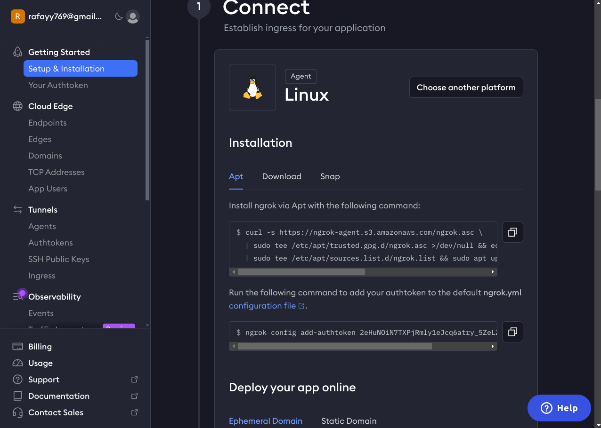
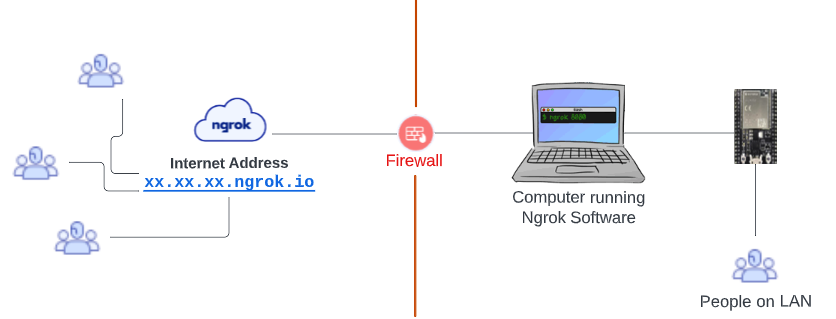
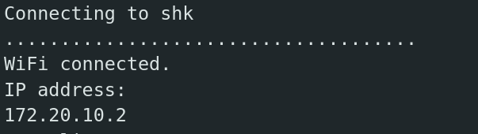
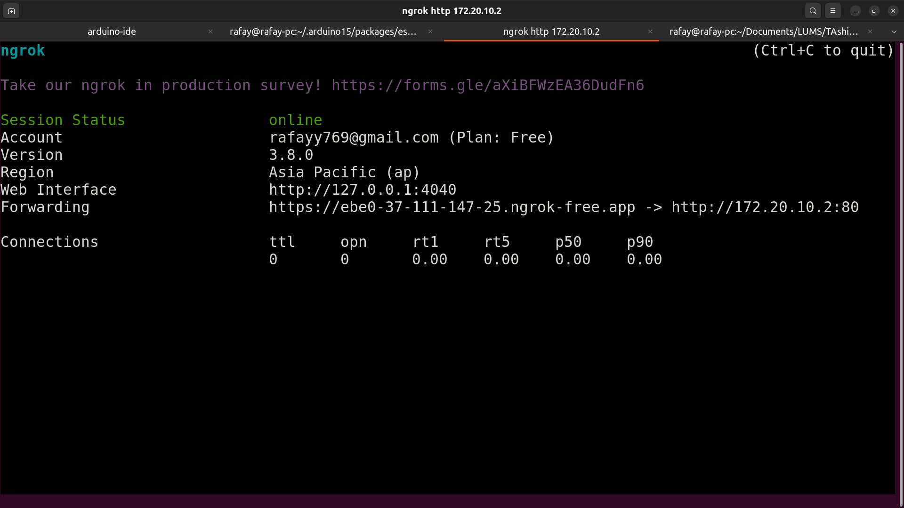
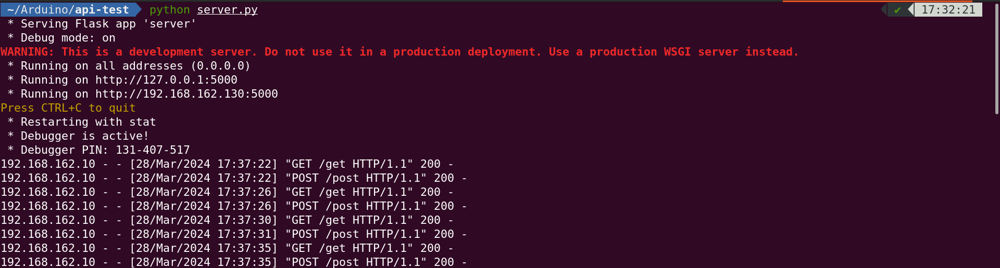
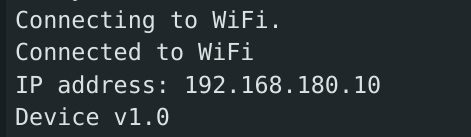
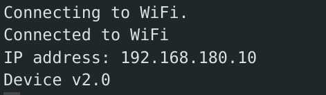

# LAB 3 - Networking and Communication
**Total tasks:** 4 (1 in-lab, 3 take-home)

**Deadline:** Sunday Apr 6, 2024 midnight

**Submission instructions:** Submit the `.ino` files, for all the tasks in the format `TaskX.ino`, where `X` is the task number. Submission tab will be made available on LMS. For the in-lab tasks, tasks submitted on dropbox will be considered. For the first take home task (Task 2), rename your screenshot to `Task2` and submit it on LMS.

## In-lab tasks:
### Task 1 - Web-server with ESP32:
Your first and "only" lab task is to simple write a basic web-server, hosted on an ESP32, that is responsible for controlling the state of two LEDs. Use the internal LED, and one external LED.

ESP32 should host a web-page which provides two "links" to control the LED state. (You can use the tag `<a href="...">`, leading to different endpoints.) The two "links" or buttons to control the LED should display the text based upon the state of the LED. So, if the LED is on, the button should say "Turn off LED", and vice versa.

Once done, you should add another "link" or "button" to get the current temperature reading of the room.

Note that the task was supposed to be done in the lab, and grading will be done based on the code submitted on LMS/dropbox during the lab timings.

## Take-home tasks:
### Task 2 - Putting ESP32 on the internet:
In this task, you will be connecting an ESP32, to a gateway so that it can be accessed over the internet. Primarily, we will be hosting a webpage on the ESP32, that can be accessed over the internet from anywhere, even with a dynamic IPv4 address.

We will be using `ngrok` for this purpose. `ngrok` is a service that allows you to expose your local server to the internet. The documentation can be found [here](https://ngrok.com/docs).

In order to complete this task, you will need to:
1. Sign up for a free account on `ngrok` at [https://dashboard.ngrok.com/signup](https://dashboard.ngrok.com/signup).
2. Download the `ngrok` client from [https://ngrok.com/download](https://ngrok.com/download).
3. The dashboard provides getting started instructions for each platform. Follow the instructions to get your `ngrok` client up and running. This involves downloading the client, adding the authtoken, and running the client. This would look something like follows:


Note that the auth token will be different for everyone.

Once `ngrok` has been set up and running, we can now expose a server running over the local network, to the internet. This is what the architecture would look like:



Your job is to create a simple web server on ESP32, that can be accessed over the internet. Since. for the task1, you have a working server that can be accessed over the local network, you can use the same code, and expose it to the internet using `ngrok`. This can be done as follows:

```bash
$ ngrok http <ESP-32 IPv4 addr>
```

So, e.g. my ESP32 received an IP-address of 172.20.10.2 after connecting to my hotspot.



You would need to connect your laptop to the same hotspot as your phone, to be present on the same network. Then, from the laptop, run the following:
    
```bash
$ ngrok http 172.20.10.2
```

This will give you a public URL, that can be used to access the server running on your ESP32.



`ngrok` provides a URL that can be accessed from anywhere in the world. You can use this URL to access the server running on your ESP32. In my case, the URL is `https://ebe0-37-111-147-25.ngrok-free.app` as evident from the screen-shot.

This task is complete when you can access the server running on your ESP32 from your phone, using the URL provided by `ngrok`. You are supposed to submit a screenshot of the webpage running on your phone, showing the URL in the address bar.

Once we are able to put the devices on the internet, the possibilities are endless, as the internet allows access from anywhere in the world. You can, theoretically, control your home, or remotely deployed devices from anywhere. Similarly, we are not limited to only ESP32 connected to the internet, this can be done with any device that supports IP networking. `ngrok` also allows you to add authentication, and static domains, which can be used to secure the connection, and make it easier to access.

### Task 3 - API calls with ESP32:
Let's move on to the next task, where you will be making API calls from the ESP32. This is a very useful feature, as it allows the ESP32 to interact with other devices, or services over the internet. This can be used to get data from the internet, or to send data to the internet.

The primary library to make API calls from the ESP32 is the `HTTPClient` library. This library allows you to make `GET`, `POST`, `PUT`, `DELETE` requests to a server, and get the response. Let's look at how to use this library. This is different from the earlier in-lab task, where you were hosting a server on the ESP32. In this task, the ESP32 will be the client, and will be making requests to a server hosted externally, either on your laptop, or on the cloud.

The `HTTPClient` library is a part of the arduino core, and is included by default. You can include the library in your code as follows:
```cpp
#include <HTTPClient.h>
```

The next step is to create an instance of the `HTTPClient` class, and use it to make requests. This is done as follows:
```cpp
HTTPClient http;
```

We can now make a request easily as follows:
```cpp
http.begin("http://<server-addr:port>");
// note that server address can also be a hostname.
int httpCode = http.GET();
```
where `http.begin()` is used to specify the URL of the server, and `http.GET()` is used to make a GET request to the server. The `httpCode` variable stores the response code from the server. The response code is a 3-digit number, e.g. 200 to indicate success, 404 to indicate not found, etc.

similarly, you can make a POST request as follows:
```cpp
http.begin("http://<server-addr:port>");
// note that server address can also be a hostname.
int httpCode = http.POST("data=10");
```
where `http.POST()` is used to make a POST request to the server, and the data is sent as a parameter to the function.

Make sure to close the connection after the request is made, as follows:
```cpp
http.end();
```

You may find the example file `API-test.ino` useful for this task. This file contains a basic HTTP client example, that makes a GET and POST request to a server periodically.

Since we have already learned how to create a basic http server in python using `flask`, we can create a simple backend server, that handles http requests on different routes. If everything is configured correctly, you may see the following output at your server.



Again, for the process to work, the two devices must be on the same local network (hotspot or wifi router), or the devices must be accessible over the internet.

#### Task:
OpenWeatherMap is a service that provides weather data for any location in the world. You can get the weather data for a location, by making a GET request to the OpenWeatherMap API. The API documentation can be found [here](https://openweathermap.org/api).

You need to first create an account at OpenWeatherMap, and get an API key. This API key is used to authenticate your requests to the OpenWeatherMap API. Once you have the API key, you can make requests to the OpenWeatherMap API, to get the weather data for any location. For example, now that I have my API key, I can make http requests to the OpenWeatherMap API, to get the weather data for Lahore, as follows:
```bash
$ curl "http://api.openweathermap.org/data/2.5/weather?q=Lahore&appid=<your-api-key>"

{"coord":{"lon":74.3436,"lat":31.5497},"weather":[{"id":803,"main":"Clouds","description":"broken clouds","icon":"04d"}],"base":"stations","main":{"temp":299.14,"feels_like":299.14,"temp_min":298.21,"temp_max":299.14,"pressure":1011,"humidity":57},"visibility":6000,"wind":{"speed":4.12,"deg":330},"clouds":{"all":75},"dt":1711631293,"sys":{"type":1,"id":7585,"country":"PK","sunrise":1711587364,"sunset":1711631940},"timezone":18000,"id":1172451,"name":"Lahore","cod":200}%
```
Note that, your API key will get activated after like 10 minutes of you signing-up so don't worry if you get the invalid API-key error.

Your task is to write a simple ESP32 application that simply makes these API calls and then prints the current weather situation on the serial monitor. Please make sure that you are not making the requests super frequently as there is a limit on the number of requests (60 calls per minute). So, just use `delay` with a large parameter, and we will be good to go.

Note that the response is in JSON format. You can use the `ArduinoJson` library to parse the JSON response, and extract the required information.

### Task 4 - Over The Air (OTA) updates:
In this task, you will be exploring how to update the firmware of the ESP32, over the air. This is a very useful feature, as it allows you to update the firmware of the device, without having to physically connect it to the computer.

Let's look into how the OTA system actually works on an ESP32. When code is flashed onto the ESP32, it is stored on ESP32 in the flash memory. Similarly, the flash memory is responsible for storing important data etc. as well. For this purpose, the flash memory uses a "partition table" to describe different partitions of the flash, where each partition is supposed to store different data. 

OTA involves updating the firmware of the ESP32, by writing the new firmware to a different partition, and then updating the partition table to point to the new firmware. More precisely, the OTA process requires adding at least two OTA app partitions, `ota0` and `ota1` as well as a OTA data partition. The OTA operation functions write a new app firmware image to whichever OTA app slot that is currently not selected for booting. Once the image is verified, the OTA Data partition is updated to specify that this image should be used for the next boot.

This way, the old firmware is still present on the device, and can be used in case the new firmware fails to boot. This is a very useful feature, as it allows the device to recover from a failed update, and continue to function.

While it is important to know the underlying details (more of which can be found [here](https://docs.espressif.com/projects/esp-idf/en/stable/esp32/api-reference/system/ota.html)), we fortunately have a library called `ArduinoOTA` available to us that makes OTA process simpler. Similarly one doesn't need to worry about the partition table, and other details.

One can implement OTA capabilities by using the `ArduinoOTA` library in the code, on the ESP32. This OTA code must be a part of subsequent firmware updates as well.

Setting up OTA capabilities requires the following:

1. Include the `ArduinoOTA.h` library in the code.
```cpp
#include <ArduinoOTA.h>
```
1. The next step is to define the OTA hostname, and password. This is not necessarily required, but a good practice regardless, so that no one can randomly update the firmware on your device. This is done as follows:
```cpp
ArduinoOTA.setHostname("yourhost"); // Set the hostname
ArduinoOTA.setPassword("yourpswd"); // Set the OTA password
```
2. We can also provide callback functions, that are called when the OTA process starts, ends, and when the OTA process is in progress. This can be done as follows:
```cpp
// gets called when OTA process starts
ArduinoOTA.onStart([]() {
    Serial.println("Start updating.");
});
// gets called when OTA process ends
ArduinoOTA.onEnd([]() {
    Serial.println("\nEnd");
});
// gets called when OTA process is in progress
ArduinoOTA.onProgress([](unsigned int progress, unsigned int total) {
    Serial.printf("Progress: %u%%\r", (progress / (total / 100)));
});
// gets called when OTA process encounters an error, we can print the error message
ArduinoOTA.onError([](ota_error_t error) {
    Serial.printf("Error[%u]: ", error);
    if (error == OTA_AUTH_ERROR)         Serial.println("Auth Failed");
    else if (error == OTA_BEGIN_ERROR)   Serial.println("Begin Failed");
    else if (error == OTA_CONNECT_ERROR) Serial.println("Connect Failed");
    else if (error == OTA_RECEIVE_ERROR) Serial.println("Receive Failed");
    else if (error == OTA_END_ERROR)     Serial.println("End Failed");
});
```
3. Finally, we need to start the OTA process. This is done as follows:
```cpp
ArduinoOTA.begin();
```
4. The above changes are for the `setup()` function. The `loop()` function must contain the following line, to allow the OTA process to run:
```cpp
ArduinoOTA.handle();
```

Adding the above code to your application, running on an ESP32, gives it the capabilities to update its firmware remotely.
In order to send updates to the device, we can use `espota.py` script, that is provided by the ESP32 core. This script is used to send the firmware to the device, and can be used as follows:
```bash
$ python3 /path/to/espota.py -i <IP-address> -f /path/to/firmware.bin -a <password> -r -d
```

1. Use the `espota.py` uploaded here for your convenience.
2. The `-i` flag is used to specify the IP address of the device. This is obtained from the serial monitor, when the device is connected to the computer.
3. The `-f` flag is used to specify the path to the firmware file that is to be uploaded to the device. You can generate the firmware file by going to "Sketch -> Export compiled binary" in the Arduino IDE. This will generate a `.bin` file in the sketch directory, or in the `build` directory, inside the sketch directory. The sketch directory is where the `.ino` file is present. 
Since, you cannot upload a sketch directly to the ESP32 using OTA with this method, a compiled binary must be provided. This binary is then uploaded to the device using the `espota.py` script.
1. The `-a` flag is used to specify the password that was set in the code.
2. The `-r` flag shows progress, and `-d` flag is used to show the debug logs.

The example file `OTA-test.ino` contains the base firmware. Flash this program directly via the arduino IDE. Observe the output in the serial monitor, you will be getting "Device v1.0" to indicate we are running on the firmware before the update.

Make sure both the esp32, and the laptop are connected to the same network. Make some changes to the `OTA-test.ino` file, e.g. update the firmware version number, or update the blinking delay etc, and then export a compiled binary, as specified earlier. The next step would be to upload the firmware to the device, using the `espota.py` script, as specified earlier. Once the firmware is uploaded, the device will restart, and the new firmware will be running on the device. You can verify this by checking the serial monitor, and observing the output.

Before the update:



After the update:



#### Task:
Your task would be to extend these simple capabilities to create a device management server at your end. Create a simple python program, that reads in a csv file of ESP32 devices, and performs firmware updates on all the devices. The csv file should contain the IP address, and the password of the device. The python program should read in the csv file, and update the firmware on all the devices, one by one. 

Note that for now, you only have access to one ESP32, so you will be putting a single entry in the csv file. However, your program should be able to handle multiple devices, or entries in the csv file. Note the format of the CSV entries :
```
IP-address,hostname,password
```

Note that you will be using `espota.py` script to update the firmware on the devices. This script can be called easily inside your python program, using the `subprocess` module. The `subprocess` module allows you to spawn new processes, connect to their input/output/error pipes, and obtain their return codes. The documentation for the `subprocess` module can be found [here](https://docs.python.org/3/library/subprocess.html).

Note that you are only sending these updates in a LAN for now, but that is the first step towards creating a device management server that can update devices over the internet. This is a very useful feature, as it allows you to update the firmware of the device(s), without having to physically connect it to the computer. It becomes especially useful when the devices are deployed in a remote location, and are not easily accessible.
